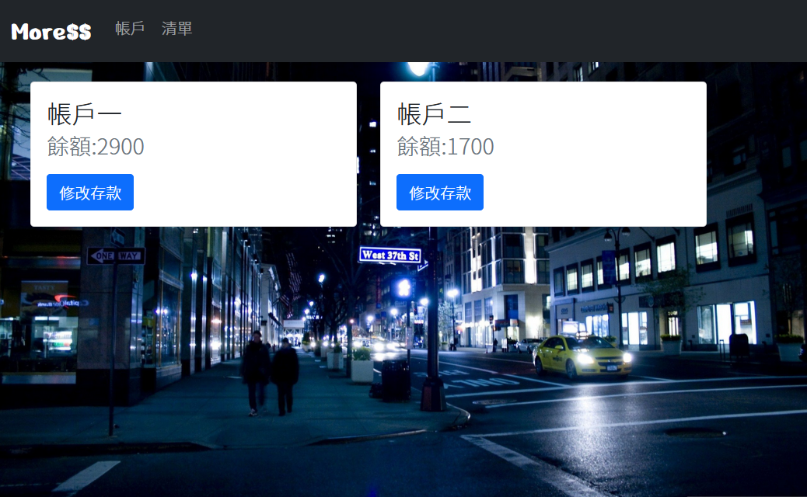
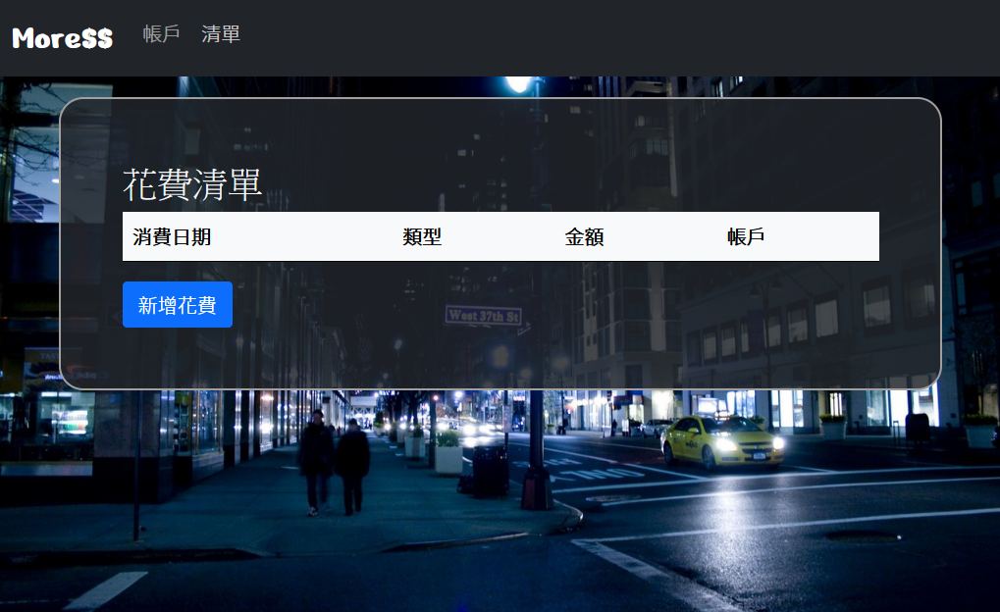
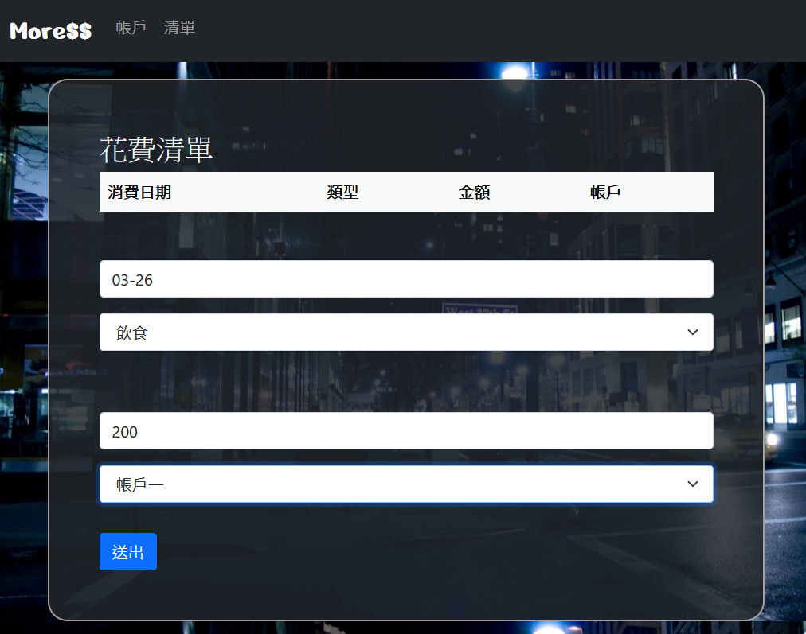
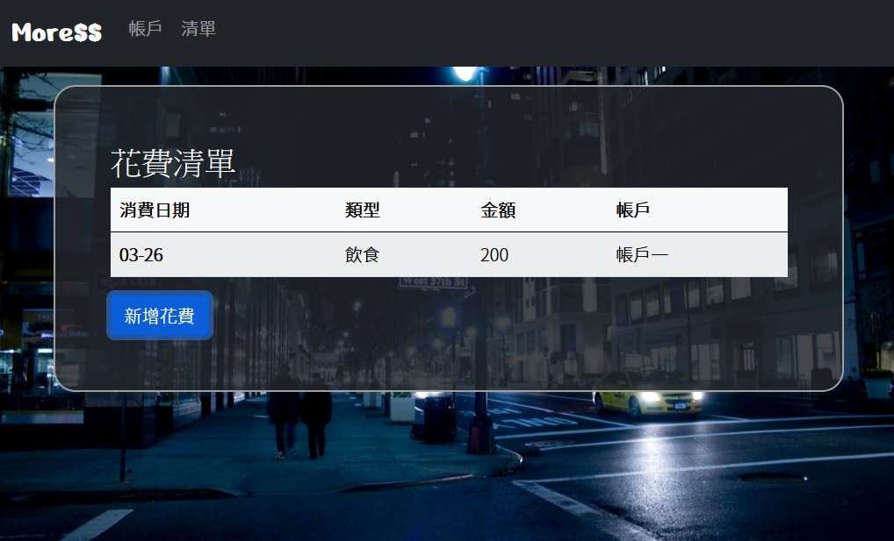
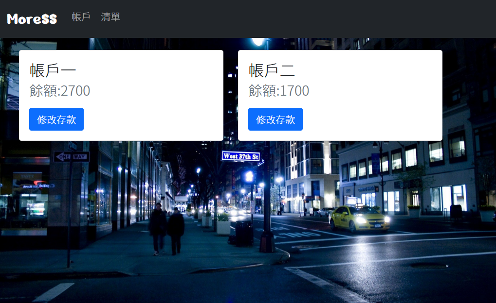
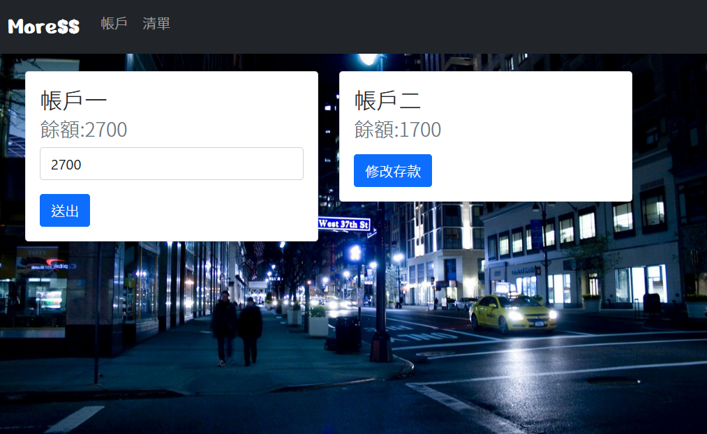
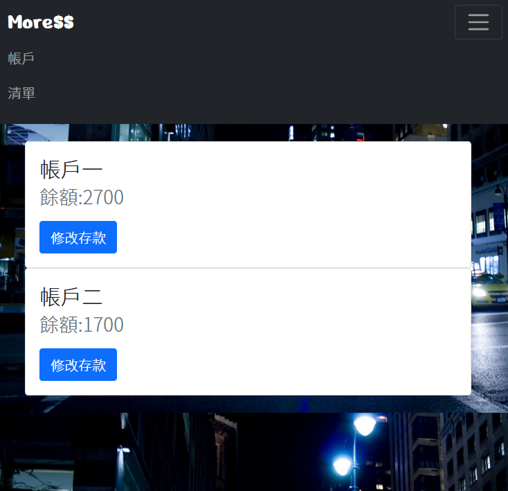
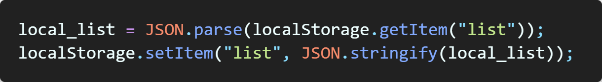
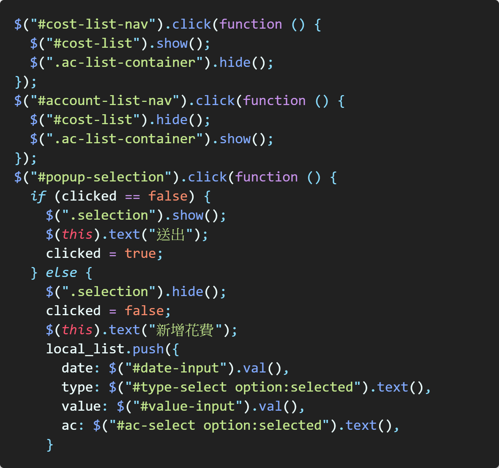

# 說明

## 國立中正大學資工一 蕭文愷

1. 設計動機:
   金錢管理是每個大學生的日常生活應該做的事，不同以往的是現在多用手機 App 紀錄而不用紙筆，市面上的記帳 App 也琳瑯滿目，卻很少可以拿來記帳的網站，因此想製作一個簡單打網址便能輕鬆紀錄花費的網站，也藉此測試這學期的所學。

2. 設計目標:

   - 完成網頁外觀設計
   - 完成 RWD 設計
   - 完成新增花費到清單、顯示帳戶餘額並能計算後儲存等功能。

3. 網站架構:

- 顯示帳戶餘額:
  在頁面顯示兩個不同帳戶扣除花費金額後所顯示的餘額，並能夠修改初始金額或當前金額。
- 花費清單:
  能顯示所有花費列表，並能新增新的一筆花費並記錄扣除帳戶及消費類別。

4. 成果展示:

1. 顯示所有帳戶餘額

2. 顯示花費清單

3. 按下新增花費後顯示新增花費表格

4. 按下送出後將資料新增到列表並關閉輸入表格

5. 從帳戶餘額中扣除花費

6. 可直接修改餘額，用於第一次開啟時

7. 無後端，將資料儲存於本地，重新開啟網頁時資料不會丟失

8. RWD – 於手機或平板顯示將導覽列摺疊並將列表改為垂直排列

5. 功能實作方法
   將資料儲存於 LocalStorage

使用 Jquery 處理事件

Javascript 建立物件並新增到陣列

6.心得:
製作過程中感覺自己的網頁相關知識仍然不夠充足，有許東功能想得到但還無法實現，只能選擇折衷方案，並體會到許多知識環環相扣，遠遠不是一學期就能精通，希望未來能夠自己充實還未具備的知識，以實現功能更加豐富的網站。
